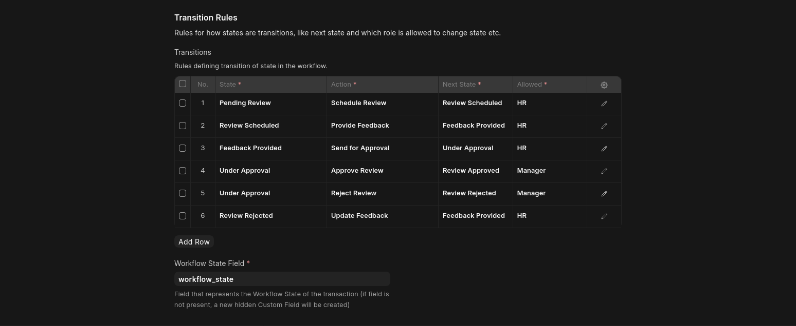

<h1 style="font-size: 30px" align="center">📋 Company Management System</h1>

---

## Table of Contents
- [Overview](#overview)
- [Documentation](#documentation)
- [Setup & Installation](#setup--installation)
- [Requirement Checklist & Assumptions](#requirement-checklist--assumptions)
- [Employee Performance Review Workflow](#employee-performance-review-workflow)
- [Security & Permissions](#security--permissions)
- [Testing](#testing)


## Overview
Company Management System that encompasses various features for managing companies, departments, employees, and projects.

### **Built with**
- Frappe Framwork
- Python

---
## Documentation
- ### **[API Documentation](docs/api/README.md)**: Detailed documentation for API endpoints.
- ### [**Demo**](docs/imgs/README.md)

---
## Setup & Installation

Before installing Frappe, ensure your system (Ubuntu 22.04+ (recommended) / Unix-like OS) has the following dependencies installed:
### Install Prerequisites
* Python 3.10+
* Node.js 18+ & NPM
* MariaDB 10.6+
* Redis (for caching and job queuing)
* Frappe Bench CLI


### Frappe Setup

```bash
sudo apt update && sudo apt upgrade -y
```

```bash
sudo apt install -y \
git \
python3-dev \
python3-pip \
python3-venv \
software-properties-common \
mariadb-server \
mariadb-client \
redis-server \
curl \
npm \
xvfb \
libfontconfig \
wkhtmltopdf
```

```bash
# installing nodejs and yarn
curl -fsSL https://deb.nodesource.com/setup_18.x | sudo -E bash -
sudo apt install -y nodejs
sudo npm install -g yarn
```

```bash
# MariaDB Configuration
sudo mysql_secure_installation
```

```bash
# Update MariaDB config:
sudo nano /etc/mysql/mariadb.conf.d/50-server.cnf
```

Add or update the following:
```ini
[mysqld]
character-set-client-handshake = FALSE
character-set-server = utf8mb4
collation-server = utf8mb4_unicode_ci
```

```bash
# Restart MariaDB:
sudo service mysql restart
```

```bash
# Upgrade pip and install bench:
pip3 install --upgrade pip
pip3 install frappe-bench
bench init frappe-bench
```

### Installation Steps
1.  **Clone the Repository:**
```bash
git clone https://github.com/Karim-Moharm/company-management-system
cd frappe-bench
```
2.  **Create the Site:**
```bash
bench new-site company_mgmt.local
```
3.  **Install the App:**
```bash
bench get-app [app_name]
bench --site company_mgmt.local install-app [app_name]
```
4.  **Start the Server:**
```bash
bench start
```

---

## Requirement Checklist & Assumptions

| Task | Status | Notes |
| :--- | :--- | :--- |
| **Data Models (User, Company, Dept)** | ✅ Complete | Includes auto-calculation of child counts. |
| **Employee & Project Models** | ✅ Complete | "Days Employed" updates via controller logic. |
| **Review Workflow Stages** | ✅ Complete | All 6 stages implemented as per requirements. |
| **Review Workflow Transitions** | ✅ Complete | Prevents invalid jumps (e.g., Pending → Approved). |
| **Role-Based Access (RBAC)** | ✅ Complete | Admin, Manager, HR and Employee roles defined. |
| **RESTful APIs** | ✅ Complete | Full CRUD for Company, Depatment, Employee, and Project. |
| **Unit & Integration Tests** | ✅ Complete | Validated via testing suite. |


### **Considerations & Assumptions:**
* **Days Employed:** Calculated based on the `Hired On` date against the current system date.
* **Auto-Calculations:** Employee, Department, and Project counts on the Company level refresh whenever a child record is created or deleted.
* **Differnet Companies Names can have same Department:** the department name is not unique so companies can have same department name, but the departmet name is uniqe for same company


---

## Employee Performance Review Workflow


For more obvios image


### Stages
1. **Pending Review**: Employee flagged for review.
2. **Review Scheduled**: Review meeting scheduled.
3. **Feedback Provided**: Feedback documented.
4. **Under Approval**: Manager reviewing feedback.
5. **Review Approved**: Feedback finalized.
6. **Review Rejected**: Feedback rejected; requires update.


### Transitions
- `Pending Review → Review Scheduled`: When review date is set.
- `Review Scheduled → Feedback Provided`: After review meeting.
- `Feedback Provided → Under Approval`: Submitting feedback for managerial approval.
- `Under Approval → Review Approved`: Manager approves feedback.
- `Under Approval → Review Rejected`: Manager rejects feedback.
- `Review Rejected → Feedback Provided`: Feedback updated after rejection.



---

## Security & Permissions
- **Role-Based Access Control**:
  - Admin: Full access
  - Manager: Access to own department and employees
  - Employee: Access to own profile and performance review
- **Authentication**: Secure sessions or token-based authentication.
- **Authorization**: Restrict API and UI access based on roles.

---