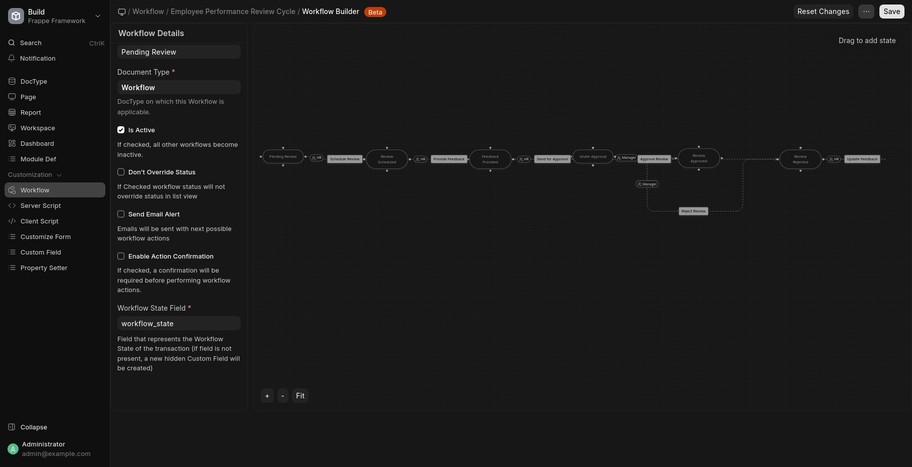
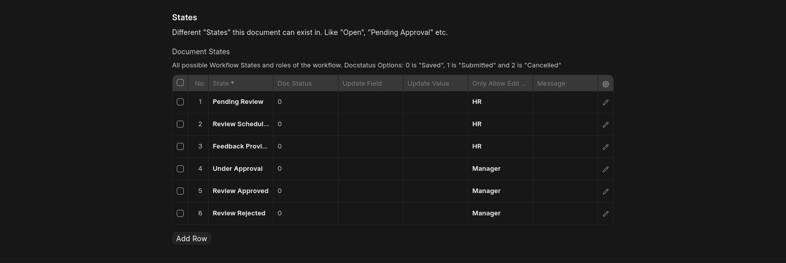

# Company Management System

## Table of Contents
- [Overview](#overview)
- [Data Models](#data-models)
- [Employee Performance Review Workflow](#employee-performance-review-workflow)
- [Security & Permissions](#security--permissions)
- [API Endpoints](#api-endpoints)
- [Setup & Installation](#setup--installation)
- [Testing](#testing)
- [Task Completion Checklist](#task-completion-checklist)
- [Considerations & Assumptions](#considerations--assumptions)

---

## Overview
This project is a **Company Management System** designed to manage:
- Companies
- Departments
- Employees
- Projects


It also includes a structured workflow for **Employee Performance Reviews** and role-based access control for secure data handling.


---
## 2. Setup & Installation

### Prerequisites
* Python 3.10+
* Node.js 18+ & NPM
* MariaDB 10.6+
* Redis (for caching and job queuing)
* Frappe Bench CLI

### Installation Steps
1.  **Clone the Repository:**
    ```bash
    git clone https://github.com/Karim-Moharm/company-management-system
    cd frappe-bench
    ```
2.  **Create the Site:**
    ```bash
    bench new-site company_mgmt.local
    ```
3.  **Install the App:**
    ```bash
    bench get-app [app_name]
    bench --site company_mgmt.local install-app [app_name]
    ```
4.  **Start the Server:**
    ```bash
    bench start
    ```


---

## Data Models

### User Accounts
- `username`
- `email` (login ID)
- `role` (Admin, Manager, Employee)

### Company
- `company_name`
- `num_departments` (auto-calculated)
- `num_employees` (auto-calculated)
- `num_projects` (auto-calculated)

### Department
- `company` (select)
- `department_name`
- `num_employees` (auto-calculated)
- `num_projects` (auto-calculated)

### Employee
- `company` (select)
- `department` (select)
- `employee_name`
- `email`
- `mobile_number`
- `address`
- `designation`
- `hired_on` (optional)
- `days_employed` (auto-calculated)

### Project
- `company` (select)
- `department` (select)
- `project_name`
- `description`
- `start_date`
- `end_date`
- `assigned_employees` (multi-select)

---

## Employee Performance Review Workflow


For more obvios image


### Stages
1. **Pending Review**: Employee flagged for review.
2. **Review Scheduled**: Review meeting scheduled.
3. **Feedback Provided**: Feedback documented.
4. **Under Approval**: Manager reviewing feedback.
5. **Review Approved**: Feedback finalized.
6. **Review Rejected**: Feedback rejected; requires update.



### Transitions
- `Pending Review → Review Scheduled`: When review date is set.
- `Review Scheduled → Feedback Provided`: After review meeting.
- `Feedback Provided → Under Approval`: Submitting feedback for managerial approval.
- `Under Approval → Review Approved`: Manager approves feedback.
- `Under Approval → Review Rejected`: Manager rejects feedback.
- `Review Rejected → Feedback Provided`: Feedback updated after rejection.


---

## Security & Permissions
- **Role-Based Access Control**:
  - Admin: Full access
  - Manager: Access to own department and employees
  - Employee: Access to own profile and performance review
- **Authentication**: Secure sessions or token-based authentication.
- **Authorization**: Restrict API and UI access based on roles.

---

## API Endpoints

### Company
- `GET /companies/`: List all companies
- `GET /companies/{id}/`: Retrieve a single company

### Department
- `GET /departments/`: List all departments
- `GET /departments/{id}/`: Retrieve a single department

### Employee
- `POST /employees/`: Create a new employee
- `GET /employees/`: List all employees
- `GET /employees/{id}/`: Retrieve a single employee
- `PATCH /employees/{id}/`: Update an employee
- `DELETE /employees/{id}/`: Delete an employee

### Project
- `POST /projects/`: Create a new project
- `GET /projects/`: List all projects
- `GET /projects/{id}/`: Retrieve a single project
- `PATCH /projects/{id}/`: Update a project
- `DELETE /projects/{id}/`: Delete a project


**Notes:**
- API follows RESTful conventions.
- Secure handling of sensitive data is ensured.

---

## Setup & Installation

### Prerequisites
- Python >= 3.10
- Node.js >= 18 (if frontend included)
- Database (PostgreSQL/MySQL/SQLite)
- Git

### Installation Steps
1. Clone the repository:
   ```bash
   git clone <repository_url>
   cd company-management-system
   ```


## 3. Requirement Checklist & Assumptions

| Task | Status | Notes |
| :--- | :--- | :--- |
| **Data Models (User, Company, Dept)** | ✅ Complete | Includes auto-calculation of child counts. |
| **Employee & Project Models** | ✅ Complete | "Days Employed" updates via controller logic. |
| **Review Workflow Stages** | ✅ Complete | All 6 stages implemented as per requirements. |
| **Review Workflow Transitions** | ✅ Complete | Prevents invalid jumps (e.g., Pending → Approved). |
| **Role-Based Access (RBAC)** | ✅ Complete | Admin, Manager, HR and Employee roles defined. |
| **RESTful APIs** | ✅ Complete | Full CRUD for Company, Depatment, Employee, and Project. |
| **Unit & Integration Tests** | ✅ Complete | Validated via testing suite. |


### **Considerations & Assumptions:**
* **Days Employed:** Calculated based on the `Hired On` date against the current system date.
* **Auto-Calculations:** Employee, Department, and Project counts on the Company level refresh whenever a child record is created or deleted.
* **Differnet Companies Names can have same Department:** the department name is not unique so companies can have same department name, but the departmet name is uniqe for same company