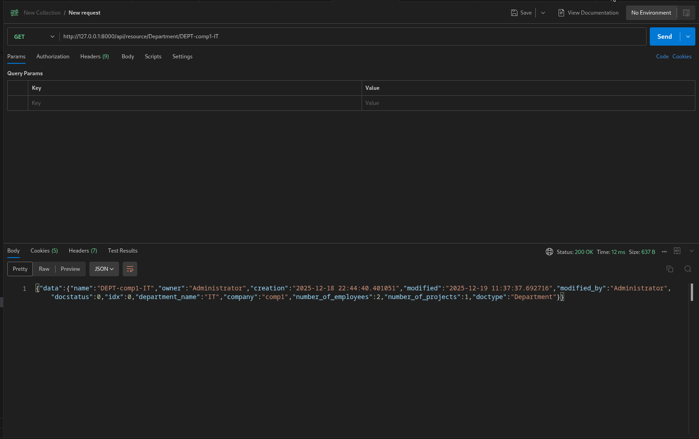

## GET /api/resource/Department

```bash
curl --location 'http://127.0.0.1:8000/api/resource/Department' \
--header 'Cookie: sid=Guest; system_user=no; full_name=Guest; user_id=Guest; user_lang=en' \
--header 'Authorization: token a0e7ec64a62c939:ebf4278767d0090'
```

Response

```json
{"data":[{"name":"Engineering"},{"name":"DEPT-comp1-IT"},{"name":"DEPT-comp1-sales"},{"name":"DEPT-BrainWise-Software"}]}

```


---

## GET /api/resource/Department/DEPT-comp1-IT

```bash
curl --location 'http://127.0.0.1:8000/api/resource/Department/DEPT-comp1-IT' \
--header 'Cookie: sid=Guest; system_user=no; full_name=Guest; user_id=Guest; user_lang=en' \
--header 'Authorization: token a0e7ec64a62c939:ebf4278767d0090'
```

Response

```json
{
    "data": {
        "name": "DEPT-comp1-IT",
        "owner": "Administrator",
        "creation": "2025-12-18 22:44:40.401051",
        "modified": "2025-12-19 11:37:37.692716",
        "modified_by": "Administrator",
        "docstatus": 0,
        "idx": 0,
        "department_name": "IT",
        "company": "comp1",
        "number_of_employees": 2,
        "number_of_projects": 1,
        "doctype": "Department"
    }
}
```




---

## PUT /api/resource/Department/DEPT-comp1-IT

```bash
curl --location --request PUT 'http://127.0.0.1:8000/api/resource/Department/DEPT-comp1-IT' \
--header 'Cookie: sid=Guest; system_user=no; full_name=Guest; user_id=Guest; user_lang=en' \
--header 'Content-Type: application/json' \
--header 'Authorization: token a0e7ec64a62c939:ebf4278767d0090' \
--data '{
    "department_name": "Security"
}'
```

Resposne

```json
{
    "data": {
        "name": "DEPT-comp1-IT",
        "owner": "Administrator",
        "creation": "2025-12-18 22:44:40.401051",
        "modified": "2025-12-19 19:41:36.906814",
        "modified_by": "Administrator",
        "docstatus": 0,
        "idx": 0,
        "department_name": "Security",
        "company": "comp1",
        "number_of_employees": 2,
        "number_of_projects": 1,
        "doctype": "Department"
    }
}
```

