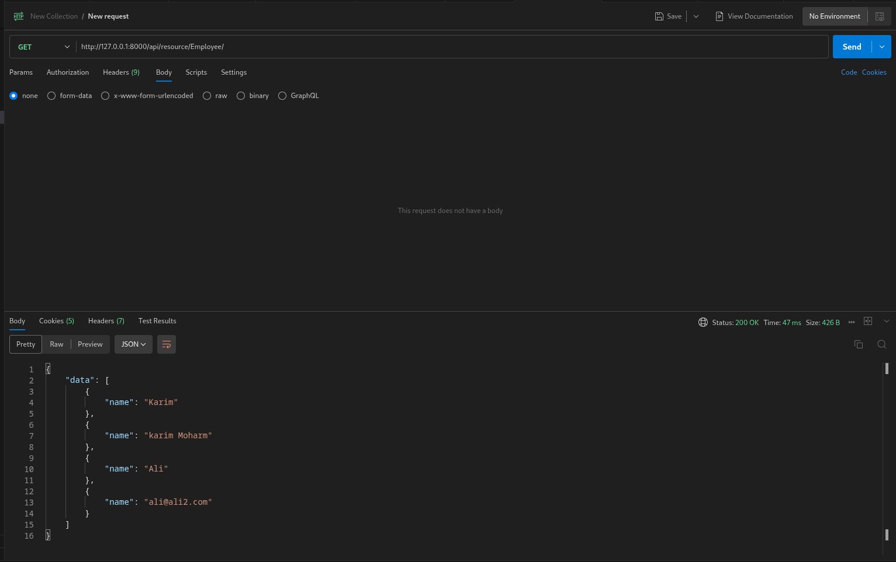
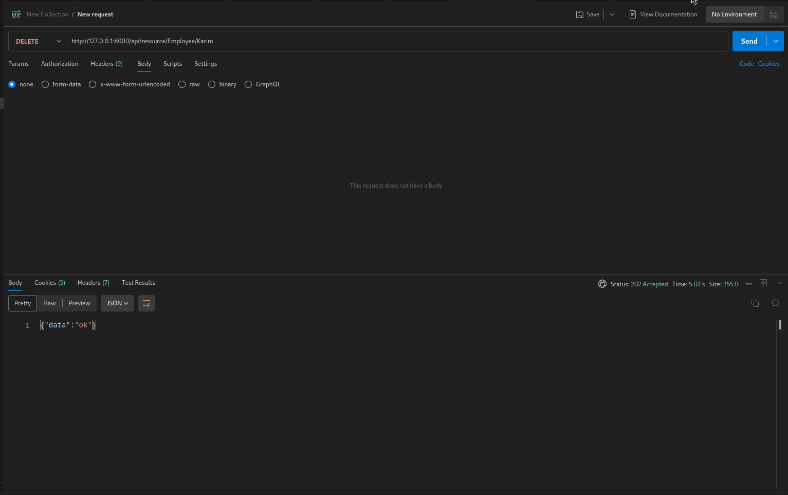

## GET /api/resource/Employee/

```bash
curl --location 'http://127.0.0.1:8000/api/resource/Employee/' \
--header 'Cookie: sid=Guest; system_user=no; full_name=Guest; user_id=Guest; user_lang=en' \
--header 'Authorization: token a0e7ec64a62c939:ebf4278767d0090'
```



Response

```json
{
    "data": [
        {
            "name": "Karim"
        },
        {
            "name": "karim Moharm"
        },
        {
            "name": "Ali"
        },
        {
            "name": "ali@ali2.com"
        }
    ]
}
```

---

## DELETE /api/resource/Employee/Karim

```bash
curl --location --request DELETE 'http://127.0.0.1:8000/api/resource/Employee/Karim' \
--header 'Cookie: sid=Guest; system_user=no; full_name=Guest; user_id=Guest; user_lang=en' \
--header 'Authorization: token a0e7ec64a62c939:ebf4278767d0090'
```

Response

```json
{"data":"ok"}
```

